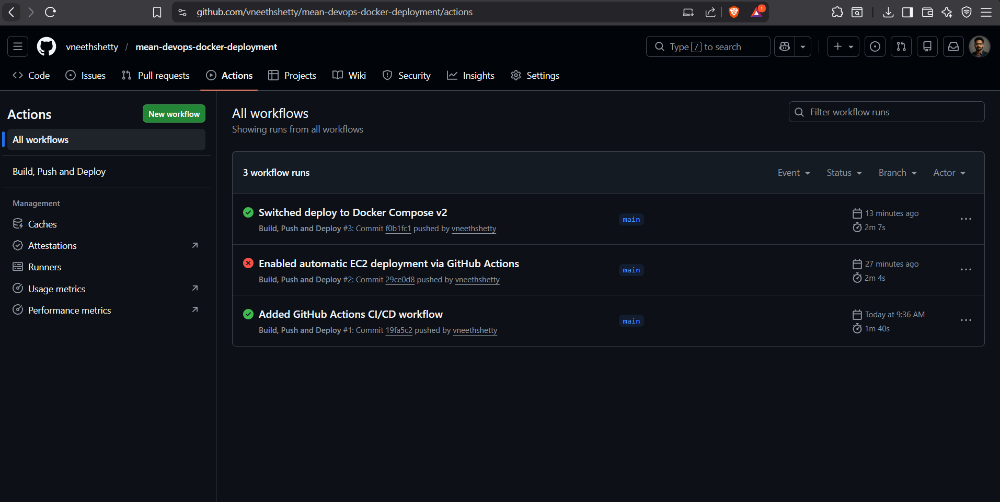
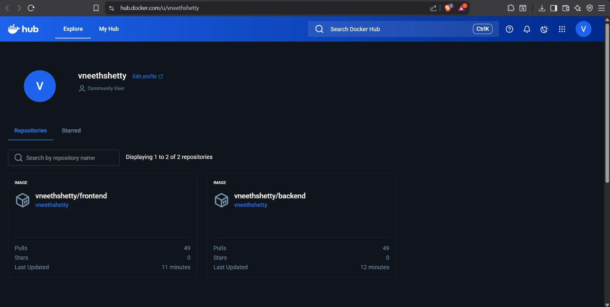
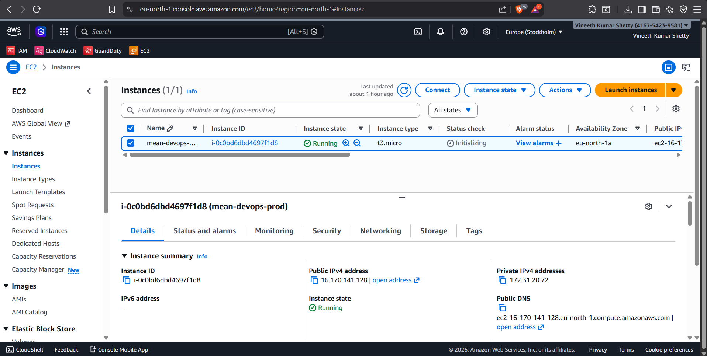
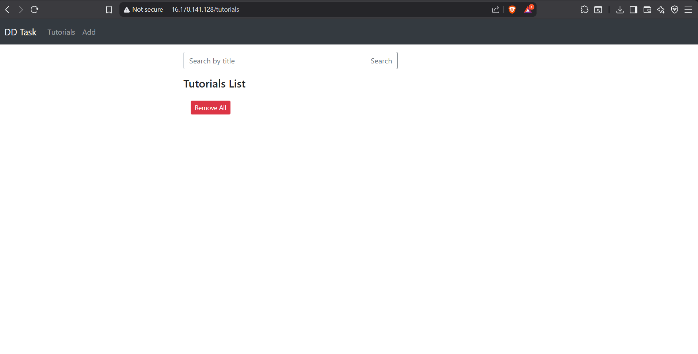
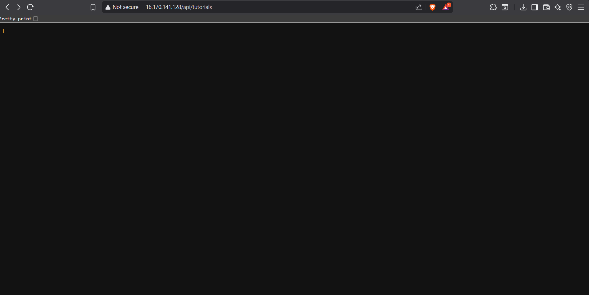
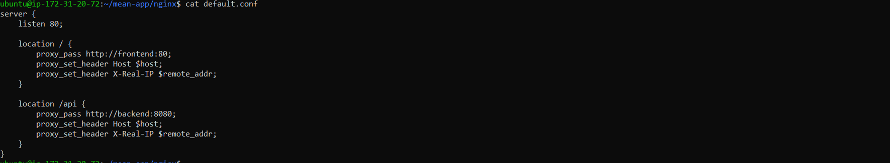

# MEAN Stack Application – Dockerized CI/CD Deployment

## 📌 Project Overview

This project demonstrates containerization, CI/CD automation, and cloud deployment of a full-stack MEAN (MongoDB, Express, Angular, Node.js) application.

The application is fully Dockerized and deployed on AWS EC2 with automated Continuous Deployment using GitHub Actions.

---

##  Architecture Overview

User  
↓  
Nginx Reverse Proxy (Port 80)  
↓  
Frontend (Angular – Served via Nginx Container)  
↓  
Backend (Node.js + Express API)  
↓  
MongoDB (Docker Volume for Data Persistence)

---

##  Technologies Used

- Angular  
- Node.js & Express  
- MongoDB  
- Docker  
- Docker Compose (v2)  
- Nginx (Reverse Proxy)  
- GitHub Actions (CI/CD)  
- AWS EC2 (Ubuntu)  

---

##  Project Structure

backend/  
frontend/  
.github/workflows/  
docker-compose.yml  
README.md  
screenshots/  

---

##  Containerization Strategy

- Separate Dockerfiles for frontend and backend  
- Multi-stage Docker build for Angular to create optimized production image  
- Official MongoDB Docker image  
- Docker Compose for multi-container orchestration  
- Nginx reverse proxy routing:
  - `/` → Frontend  
  - `/api/*` → Backend  

---

#  Step-by-Step Setup & Deployment Instructions

##  Clone Repository
# MEAN Stack Application – Dockerized CI/CD Deployment

##  Project Overview

This project demonstrates containerization, CI/CD automation, and cloud deployment of a full-stack MEAN (MongoDB, Express, Angular, Node.js) application.

The application is fully Dockerized and deployed on AWS EC2 with automated Continuous Deployment using GitHub Actions.

---

# 🚀 Step-by-Step Setup & Deployment Instructions

##  Clone Repository
git clone https://github.com/vneethshetty/mean-devops-docker-deployment
cd <project-folder>

##  Run Application Locally Using Docker

### Build and Start Containers
docker compose up --build

##  Run Application Locally Using Docker

### Build and Start Containers : http://localhost

### Stop Containers
docker compose down

---

# Cloud Deployment (AWS EC2)

## Launch EC2 Instance

- Ubuntu 22.04  
- Open inbound ports:
  - 22 (SSH)  
  - 80 (HTTP)  

---

##  Install Docker on EC2

---

# ☁ Cloud Deployment (AWS EC2)

## 1️⃣ Launch EC2 Instance

- Ubuntu 22.04  
- Open inbound ports:
  - 22 (SSH)  
  - 80 (HTTP)  

---

## 2️⃣ Install Docker on EC2
sudo apt update
sudo apt install docker.io -y
sudo apt install docker-compose-plugin -y
sudo usermod -aG docker ubuntu

Reconnect to apply Docker permissions.

## 3️⃣ Create Deployment Directory
mkdir mean-app
cd mean-app

Copy the `docker-compose.yml` file and Nginx configuration into this directory.

---

## Deploy Application
docker compose pull
docker compose up -d

The application will be accessible via the EC2 public IP on port 80.

---

# 🔄 CI/CD Pipeline (GitHub Actions)

The CI/CD workflow triggers automatically on every push to the `main` branch.

### Workflow Steps

1. Checkout repository  
2. Build backend Docker image  
3. Build frontend Docker image  
4. Push images to Docker Hub  
5. SSH into EC2  
6. Pull latest images  
7. Restart containers using Docker Compose  

This ensures fully automated Continuous Deployment.

---

# 🔐 Secrets Management

Sensitive credentials are securely stored in GitHub Repository Secrets:

- Docker Hub credentials  
- EC2 SSH private key  
- EC2 host information  

No sensitive information is stored inside the source code.

---

# 💾 Database Persistence

MongoDB uses a Docker named volume:
mongo-data

This ensures:

- Data persistence across container restarts  
- Data retention after deployment updates  
- Storage backed by EC2 EBS volume  

---

# 📦 Useful Docker Commands

View running containers:

docker compose ps

View logs:
docker compose logs -f

stop application:
docker compose down

Access MongoDB container:
docker exec -it <mongodb-container-name> mongosh

## 📸 Screenshots

### 🔹 GitHub Actions - Successful Pipeline

### 🔹 Docker Hub Images

### 🔹 AWS EC2 Instance

### 🔹 Live Application (Public IP)

### 🔹 API Response

### 🔹 Nginx Reverse Proxy Configuration

